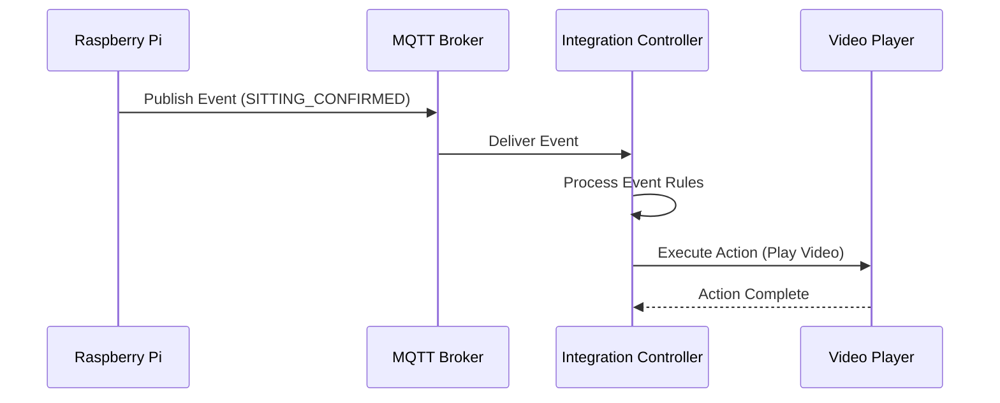
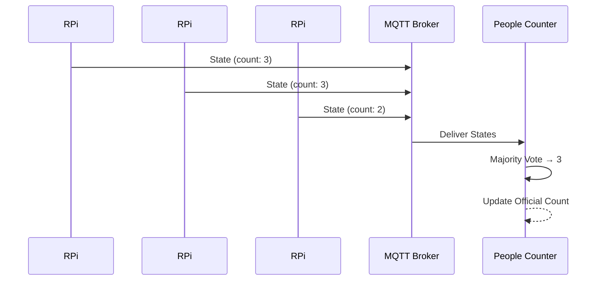

# アーキテクチャ詳細

最終更新日: 2025年7月2日

## 概要

Future Platformは、イベント駆動アーキテクチャ（EDA）を採用した分散システムです。各コンポーネントは疎結合で、MQTTメッセージングを介して通信します。

## システム構成

### 全体アーキテクチャ

```
┌─────────────────────────────────────────────────────────────────┐
│                        物理空間レイヤー                            │
│                                                                 │
│   Camera 1 ──┐    Camera 2 ──┐    Camera 3 ──┐    Camera 4 ──┐│
│              │               │               │               ││
│   RPi #1 ────┤    RPi #2 ────┤    RPi #3 ────┤    RPi #4 ────┤│
│              │               │               │               ││
└──────────────┴───────────────┴───────────────┴───────────────┴─┘
                │                               │
                │ MQTT (JSON)                   │ UDP/RTP (H.264)
                ▼                               ▼
┌─────────────────────────────┐ ┌─────────────────────────────────┐
│      メッセージング層        │ │         映像ストレージ層          │
│  ┌───────────────────────┐ │ │ ┌─────────────┐ ┌───────────┐ │
│  │    MQTT Broker        │ │ │ │  GStreamer  │ │   MinIO   │ │
│  │    (Mosquitto)        │ │ │ │  Recorder   │─▶│  Storage  │ │
│  └───────────┬───────────┘ │ │ └─────────────┘ └───────────┘ │
└──────────────┼─────────────┘ └─────────────────────────────────┘
                │
                ▼
┌─────────────────────────────────────────────────────────────────┐
│                    統合管理システム層                              │
│  ┌────────────────┐  ┌────────────────┐  ┌─────────────────┐  │
│  │ MQTT Service   │  │Event Processor │  │ People Counter  │  │
│  └───────┬────────┘  └───────┬────────┘  └────────┬────────┘  │
│          │                   │                     │           │
│          └───────────────────┴─────────────────────┘           │
│                              │                                  │
│                    ┌─────────▼──────────┐                      │
│                    │Integration Controller│                     │
│                    └─────────┬──────────┘                      │
│                              │                                  │
│                    ┌─────────▼──────────┐                      │
│                    │ Action Executor    │                      │
│                    └─────────┬──────────┘                      │
└──────────────────────────────┼─────────────────────────────────┘
                               │
                               ▼
┌─────────────────────────────────────────────────────────────────┐
│                        出力システム層                             │
│  ┌────────────────┐                    ┌────────────────┐      │
│  │ Video Player   │                    │ Audio Player   │      │
│  │    System      │                    │    System      │      │
│  └────────────────┘                    └────────────────┘      │
└─────────────────────────────────────────────────────────────────┘
```

## コンポーネント詳細

### 1. センサーノード（Raspberry Pi）

**責務:**
- カメラ映像の取得
- リアルタイム画像解析（YOLOv8 + MediaPipe）
- イベント・状態の検知と送信
- 映像ストリーミング

**技術スタック:**
- OS: Raspberry Pi OS
- 言語: Python 3.9+
- 主要ライブラリ: OpenCV, YOLOv8, MediaPipe, paho-mqtt, GStreamer

**通信:**
- 出力: MQTT（状態・イベント）、UDP/RTP（映像）
- フォーマット: JSON、H.264

### 2. MQTTブローカー（Mosquitto）

**責務:**
- メッセージのルーティング
- Pub/Subパターンの実現
- QoS保証

**設定:**
- ポート: 1883（MQTT）、9001（WebSocket）
- 認証: オプション（本番環境では必須）
- 永続化: 有効

**トピック構造:**
```
sensor/+/state    # 状態更新（例: sensor/camera1/state）
sensor/+/event    # イベント通知（例: sensor/camera2/event）
controller/+/cmd  # コマンド送信（将来拡張用）
```

### 3. 統合管理システム（本リポジトリ）

#### 3.1 MQTT Service

**責務:**
- MQTTブローカーとの接続管理
- メッセージの受信と解析
- 自動再接続

**特徴:**
- 再接続ロジック（最大10回試行）
- メッセージバリデーション
- イベントエミッター実装

#### 3.2 Event Processor Service

**責務:**
- イベントルールの管理
- イベントとアクションのマッピング
- 状態履歴の保持

**ルールエンジン:**
```typescript
interface EventRule {
  eventName: string;
  condition?: (event: EventMessage) => boolean;
  actions: ActionRequest[];
}
```

#### 3.3 People Counter Service

**責務:**
- 複数カメラからの人数情報統合
- 多数決アルゴリズムによる正確な人数決定
- 統計情報の提供

**アルゴリズム:**
1. 各カメラから人数を収集
2. 30秒以上古いデータは除外
3. 3台以上のカメラがある場合は多数決
4. 同数の場合は保守的に多い方を採用

#### 3.4 Action Executor Service

**責務:**
- アクションキューの管理
- 優先度付き実行
- 外部システムとの通信

**優先度:**
- HIGH: 即座に実行（割り込み）
- NORMAL: 通常のキュー処理
- LOW: 他のアクション完了後

### 4. 映像蓄積システム

**構成:**
- GStreamer: UDP/RTPストリームの受信とMP4変換
- MinIO: オブジェクトストレージ

**データ構造:**
```
MinIO/
├── camera-camera1/
│   ├── 20250702_120000_camera1_segment_0.mp4
│   ├── 20250702_120100_camera1_segment_1.mp4
│   └── ...
├── camera-camera2/
│   └── ...
```

## データフロー

### イベント発生時のフロー



### 人数カウントのフロー



## スケーラビリティ

### 水平スケーリング

- **センサーノード**: 最大N台まで追加可能
- **統合管理システム**: 複数インスタンス対応（Redis等での状態共有が必要）
- **映像ストレージ**: MinIOクラスター構成可能

### 垂直スケーリング

- **処理能力**: イベント処理は非同期実行
- **メモリ**: 状態履歴のサイズ制限あり（設定可能）

## セキュリティ考慮事項

1. **MQTT通信**: TLS/SSL対応（本番環境）
2. **認証**: MQTT認証、MinIO認証
3. **ネットワーク分離**: VLANによる分離推奨
4. **アクセス制御**: 最小権限の原則

## パフォーマンス特性

- **レイテンシ**: イベント検知から実行まで < 100ms
- **スループット**: 1000イベント/秒まで対応
- **映像録画**: 4ストリーム同時、各1080p@30fps